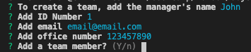

# Team Profile Generator

## OVERVIEW
This is a command line node application that will generate a profile of a software engineering team in HTML. In order to increase visibility and ease of communcation among team members, this application will be a useful tool for the manager to efficiently compile team information. 

## INSTALLATION
In order to ensure proper functionality, please download node.js.

Dependencies required: 
* inquirer version 6.3.1
* fs 
* jest version 25.1.0

## Instructions
1. Direct to the folder containing "app.js"
2. Ensure all dependencies are downloaded by running the following command: 
``` 
npm install 
```
3. Next, run the following command: 
```
node app.js
```
4. You will first be prompted to add to the manager's information
>
5. Once you have finished, you will be asked if you want to add a team member. To add the next team member's infomration, type "y".
> 
6. You can choose between adding an engineer or an intern. Use the arrow keys to select the role and then press enter.
7. Enter the engineer's GitHub username.
8. You will again be prompted to add a new team member.
9. All information for the intern is the same as the engineer, with the exception of the GitHub username. When you choose "intern", you will be prompted to enter the school he/she attends.
> 
10. When you are finished building your team, simply enter "n".
11. You will then see the following console log:
> 
12. Look for the newly created "team.html" file created in the "output" folder.


## CREDITS
Author: [crispysodium](https://github.com/crispysodium)

## TESTS
There are jest tests for each role. In order to run tests, simply run this command:
```
npm run test
```

## CONCEPTS LEARNED & APPLIED
* Node
* Jest
* Classes & Constructors
* Asynchronous Promise Handling
* Inquirer question user prompt
* Rendering HTML asynchronously
